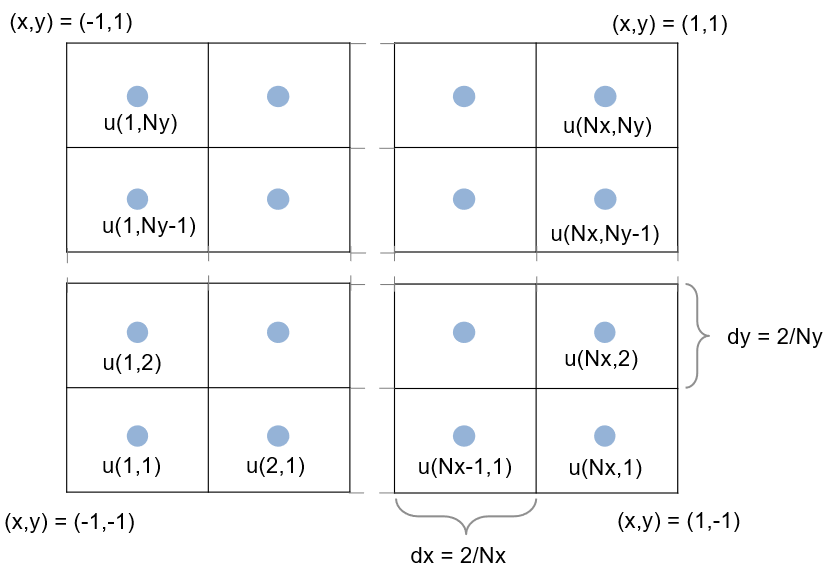
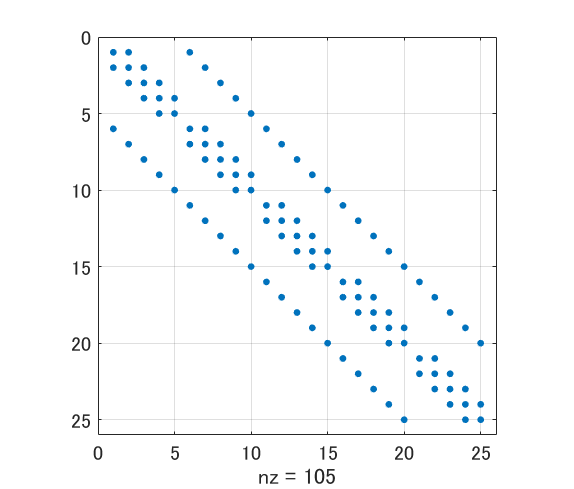
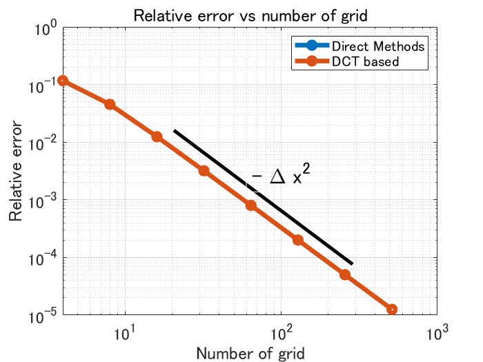
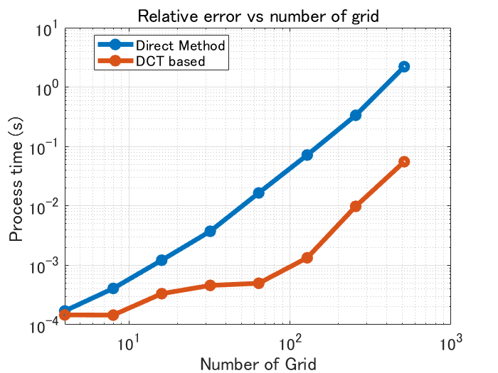

# Fast Poisson Equation Solver using DCT


Copyright 2020 The MathWorks, Inc.


# Introduction


This document describes the FFT based fast solver of the Poisson equation of the form:


Here we suppose the simple grid and the 2nd order finite difference scheme.


This document describes two methods to solve this discretized equation for . One is by directly solving the linear equations, and the other uses **D**iscrete **C**osine **T**ransform (DCT: [wiki page](https://en.wikipedia.org/wiki/Discrete_cosine_transform)). MATLAB code follows.


From the left: Example of a solution of a Poisson equation, numerical error from the exact solution vs. the grid number, and processing time vs. the grid number.


If you took CFD class at university, you must be familiar with this, as it appears in solving incompressible Navier-Stokes equations. Please note: Although we use FFT, this is only 2nd order, not the spectral accuracy.


  
## Environment 


MATLAB R2019b


Signal Processing Toolbox (`dct` [doc page](https://jp.mathworks.com/help/signal/ref/dct.html)) 


or


Image Processing Toolbox (`dct2` [doc page](https://jp.mathworks.com/help/images/ref/dct2.html))


  


There are two different functions to perform DCT depending on if it's one dimension or two dimensions, and they are in different toolboxes. DCT itself can be achieved by `fft` function` (`[File Exchange: dctt](https://jp.mathworks.com/matlabcentral/fileexchange/18924-dctt)) but here we used `dct2.` I leave the task of replacing it with `fft` to the reader.


# Computational Cost: Direct methods vs. DCT based


Solving partial differential equation sounds scary, but after descritazation it's a just a set of linear equations . If you solve this by directly inverting the matrix, the cost is (in general) . This means that if you double the grid number, the cost is estimated to be 4^3 = 64 times more for 2D, **8^3 = 512 times more for 3D case. **


If is static and does not change over time and one needs to solve it repetitively, you can precompute LU decomposition. This will decrease the cost but still . The Iterative solver can be alternative, but here we make the use of the good nature of and diagonalize by the use of DCT. I believe the cost of FFTW is  according to their documentation. 


  
# Problem Setting


To easily validate the solution, we solve


with the exact solution of 


Suppose a staggered grid (see below) with  is defined at the center of each grid cell. The computational domain is  and . The boundary condition is Neumann, . Here for the sake of simplicity, the gradient is 0, but I can be any value. In case you want to use Dirichlet BC, Discrete Sine Transform will be useful.





Since we are using 2nd order scheme, it helps to have one ghost cell outside of the domain as


we can keep the same stencil at and inside the boundary.


  
# Direct Method


Please note that if we express


as a set of linear equations , where  is a second-order centered finite difference operator and  is a modified right-hand side accommodating the boundary conditions.  is a vector of solution


If we have  and  grid points in x and y directions respectively,  is a matrix of ,  and  are vectors of .


 is sparse and is going to look like the following (, used `spy` function to draw):





The values related to the derivative in x-direction locate next to each other, but ones from the y-derivative are a little far, and it makes the bandwidth of the matrix wider. The situation is worse in 3D as you can imagine. 


Here's the function to solve the equation: Constructing  is the most cumbersome part, but once it's built \texttt{} (backslash) will take care of it.


```matlab
function [x,y,u] = solvePoissonEquation_direct(Nx,Ny)

arguments 
    Nx (1,1) {mustBeInteger,mustBeGreaterThan(Nx,1)}
    Ny (1,1) {mustBeInteger,mustBeGreaterThan(Ny,1)}
end

dx = 2/Nx; dy = 2/Ny;

% The location of u（NOTE: Staggered Grid）
xx = -1+dx/2:dx:1-dx/2;
yy = -1+dy/2:dy:1-dy/2;
[x,y] = ndgrid(xx,yy); % Note: not meshgrid

% Constructing a matrix A (sparse matrix to save memory usage)
% 行列 A の構築（メモリ節約のためスパース行列で定義）
% Start with the x-derivative (tri-diagonal matrix)
% まず x 方向の微分に関する部分（三重対角行列）から定義します。
tmp = -2*ones(Nx,1);
tmp([1,end]) = -1; % Neumann BC requires -1 (not -2) at both ends
Ad = diag(tmp);
Au = diag(ones(Nx-1,1),1);
Al = diag(ones(Nx-1,1),-1);
Ax = Ad+Au+Al;

% Consider y-derivative = it become block diagnal matrix
%  y 方向の微分に関する部分も入れつつ = ブロック対角行列を作ります
% Define the container first
% 入れ物となるスパース行列を定義
% Abig = zeros(Nx*Ny,Nx*Ny,'like',sparse(1));
% dd = eye(Nx);
% for jj=1:Ny
%     if jj==1 || jj==Ny % y-ends（Neumann BC)
%         Abig(1+Nx*(jj-1):Nx*jj,1+Nx*(jj-1):Nx*jj) = Ax/dx^2 - dd/dy^2;
%     else
%         Abig(1+Nx*(jj-1):Nx*jj,1+Nx*(jj-1):Nx*jj) = Ax/dx^2 - 2*dd/dy^2;
%     end
%     if jj~=1 % j
%         Abig(1+Nx*(jj-1):Nx*jj,1+Nx*(jj-2):Nx*(jj-1)) = dd/dy^2;
%     end
%     if jj~=Ny
%         Abig(1+Nx*(jj-1):Nx*jj,1+Nx*(jj-0):Nx*(jj+1)) = dd/dy^2;
%     end
% end

% The above can be written a little simpler:
% 上と同じ行列をもう少し完結に書くとこちら。
% Construct the block diagonal matrix
% まずブロック対角行列成分を作成
dd = eye(Nx);
tmp = repmat({sparse(Ax/dx^2 - 2*dd/dy^2)},Ny,1);
tmp{1} = Ax/dx^2 - dd/dy^2;
tmp{Ny} = Ax/dx^2 - dd/dy^2; % y-ends（Neumann BC)
Abig = blkdiag(tmp{:}); 

% A matrix (one block smaller)
% 1ブロック分小さい対角行列で y微分成分を作成
d4y = eye(Nx*(Ny-1),'like',sparse(1));
Abig(1:end-Nx,Nx+1:end) = Abig(1:end-Nx,Nx+1:end) + d4y/dy^2; % upper
Abig(Nx+1:end,1:end-Nx) = Abig(Nx+1:end,1:end-Nx) + d4y/dy^2; % lower

% Construction A is done. Let's make the right hand side f
f = - 2*pi^2.*cos(pi*x).*cos(pi*y);
f = f(:); % make it a vector

% Natually, Abig is a singular matrix. Poisson eq with Neumann BC
% does not provide a unique solution. Thus fixing u to be 0 at one point.
% Abig は特異行列でありこのままでは
% ポワソン方程式＋Neumann 境界だと解が一意に定まらないので、
% 1点を u = 0 と固定して解とします。
Abig(1,:) = 0;
Abig(1,1) = 1;
f(1) = 0;

% Solve the system of equation
u = Abig\f;

% Put the solution (a vector) back to 2d matrix
u = reshape(u,[Nx,Ny]);

end
```
  
# Discrete Cosine Transform Based


Here we use [REDFT10 (DCT-II)](http://www.fftw.org/fftw3_doc/1d-Real_002deven-DFTs-_0028DCTs_0029.html) defined in FFTW.


  
## Why do we need cosine transform?


We do not have periodic boundary conditions, but can we use FFT?  Here a quote from the FFTW documentation: 


> Because of the even symmetry, however, the sine terms in the DFT all cancel and the remaining cosine terms are written explicitly below. This formulation often leads people to call such a transform a discrete cosine transform (DCT), although it is really just a special case of the DFT. [FFTW:1d Real-even DFTs (DCTs)](http://www.fftw.org/fftw3_doc/1d-Real_002deven-DFTs-_0028DCTs_0029.html)


The original array of data (say,{12345}) will be expanded in such a way that the extended array has an even symmetry (say, {1234554321}) and periodicity. And it helps to diagonalize the matrix  as described in detail below. FFTW has four DCTs (DCT-I to DCT-IV) for four variations of "symmetry" and these are implemented in *dct* and *dct2* of MATLAB.


  
## Does this work for higher-order schemes too?


Yes but not always. Here are some quate from Simens et al. (2009)


> the Gibb’s errors due to the implicit derivative discontinuities at the non-periodic end points are of order dx^2


> higher-order schemes in non-periodic domains cannot be treated in this (be expanded in cosines series) way, because they require boundary schemes with different modified wavenumbers than the interior operator". (Simens, M., Jim´enez, J., Hoyas, S., Mizuno, Y., 2009. A high-resolution code for turbulent boundary layers. Journal of Computational Physics.)


This is because the matrix to be solved should have boundary schemes that give the same modified wave number throughout the domain, including the boundary, which is not always the case for the higher-order scheme. However, if one recognizes the difference between the matrix solved using discrete cosine transform and the matrix that actually needs to be solved, one can overcome this issue.


  
## Let's apply DCT to the discrete Poisson Equation


Applying DCT in both (x and y) directions, we obtain


Substituting it to the discretized equations and ***after simple algebra***, each term becomes


  


You can see clear symmetric structure. Here we define,


In simplifying the equations, the relationship 


comes in handy. Eventually, the discretized equation, 


finally becomes


and we get  of independent equations. In relation to spectoral methods,  and  are also called **modified wavenumber**.


  


Here's the function to solve the equation with DCT: 


```matlab
function [x,y,u] = solvePoissonEquation_2dDCT(Nx,Ny)

arguments 
    Nx (1,1) {mustBeInteger,mustBeGreaterThan(Nx,1)}
    Ny (1,1) {mustBeInteger,mustBeGreaterThan(Ny,1)}
end

dx = 2/Nx; dy = 2/Ny;
% The location of u（NOTE: Staggered Grid）
xx = -1+dx/2:dx:1-dx/2;
yy = -1+dy/2:dy:1-dy/2;
[x,y] = ndgrid(xx,yy); % Note: not meshgrid

% modified wavenumber
kx = 0:Nx-1;
ky = 0:Ny-1;
mwx = 2*(cos(pi*kx/Nx)-1)/dx^2;
mwy = 2*(cos(pi*ky/Ny)-1)/dy^2;

% 2D DCT of f (Right hand side)
f = - 2*pi^2.*cos(pi*x).*cos(pi*y);
fhat = dct2(f); % Needs Image Processing Toolbox
% fhat = dct(dct(f)')'; % Same as above (Needs Signal Processing Toolbox instead)

[MWX, MWY] = ndgrid(mwx,mwy);
uhat = fhat./(MWX+MWY);

% The solution is not unique (uhat(0,0) = inf);
% Here we fix the mean ( with kx=0,ky=0) to be 0
uhat(1,1) = 0;

% Inverse 2D DCT
u = idct2(uhat); % Needs Image Processing Toolbox
% u = idct(idct(uhat)')'; % Same as above (Needs Signal Processing Toolbox instead)

end
```
  
## Appendix: DCT in one direction only


Of course you do not have to perform 2D DCT. When you perform DCT in x-direction only,


Finite difference in y-direction is denoted as  and that of x-direction  is now diagonalized. Here we have  number of independent tridiagonal matrixs , in other words, we need to solve  for each :


The required computational cost is  ([Wikipedia: Tridiagonal matrix](https://en.wikipedia.org/wiki/Tridiagonal_matrix)). If your problem is massive and needs to run in parallel, this strategy might fit better depending on your parallelization strategy.


  
# Code Validation 


Let's check if `solvePoissonEquation_direct.m` and `solvePoissonEquation_2dDCT.m` solves the equations and their computational costs.


## Do we have the right solution?



  


As expected, you can clearly see the 2nd order regression from both schemes (yes, we are solving the exact same discretized equations.) Increasing the grid number by 10, the relative error from the exact solution becomes 1/100. Good.


  
## Performance?




The method with DCT runs faster, and the Direct Methods is still about . Not so bad, probably thanks to MATLAB's  `\` (backslash) operators. 


  
# Summary


We compared the two methods for solving a Poisson Equation with Neumann BC; the direct method and the method used DCT.


Of course, DCT might not appropriate for uneven grid or the more complicated boundary conditions. But for the cases that DCT can be applied, the code becomes consise and its performance is better.


