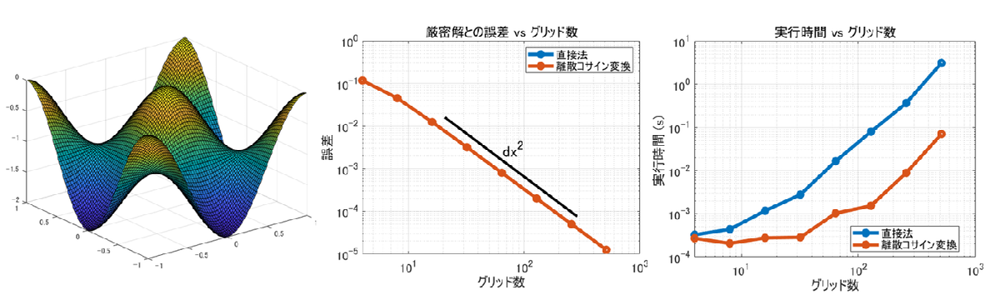
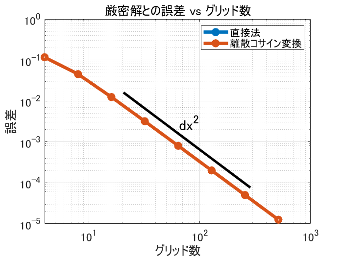

# Fast Poisson Equation Solver using DCT


Copyright 2020 The MathWorks, Inc.


# はじめに


ポワソン方程式の解を数値的に高速()に求めるお話。


単純な格子を想定した以下の有限差分式（２次精度）


を直接法と[離散コサイン変換](https://ja.wikipedia.org/wiki/%E9%9B%A2%E6%95%A3%E3%82%B3%E3%82%B5%E3%82%A4%E3%83%B3%E5%A4%89%E6%8F%9B) (DCT, **D**iscrete **C**osine **T**ransform) を使う方法を MATLAB コードとともに紹介します。





左からそれぞれ、ポワソン方程式の解（例）、厳密解との誤差比較、処理時間の比較


  


数値流体力学の授業を取ったことがある方はピンときたかもしれませんが、非圧縮性 Navier-Stokes 方程式を解くときにでてきますね。


今回紹介する方法はスペクトル法と違って 2 次精度のままですのでご注意を。スペクトル法については [Qiita: 趣味でスペクトル法_\#003_2次元周期流](https://qiita.com/toya42/items/03d3060de125a4289f9c) by @toya42 さんもお勧め。


## 環境


MATLAB R2019b


Signal Processing Toolbox (`dct` 関数 [公式 doc page](https://jp.mathworks.com/help/signal/ref/dct.html))


Image Processing Toolbox (`dct2` 関数 [公式 doc page](https://jp.mathworks.com/help/images/ref/dct2.html))


（どちらかあればOK）


  


離散コサイン変換をする関数が1次元と2次元で違う Toolbox に入っています。離散コサイン変換自体は MATLAB 本体の `fft` 関数を使っても実現可能（例えばこれ[ File Exchange: dctt](https://jp.mathworks.com/matlabcentral/fileexchange/18924-dctt)）ですが、あるものは使った方が楽なので今回は `dct` または `dct2` を使います。


  
# 計算量：直接法 vs 離散コサイン変換


偏微分方程式の解を求めるとは言え、結局は連立 1 次方程式  を解くことになるのですが、直接法で解こうとすると一般的には の計算量。すなわち格子サイズを半分（グリッド数を 2 倍）にするだけで、2 次元の場合で 4^3 = 64 倍、**3 次元の場合 8^3 = 512 倍の計算量**となる試算になります。解釈あっている？怖すぎる。


  


が変化せず、繰り返し計算する場合であれば事前に LU 分解しておくことで、多少緩和できそうですがそれでも .


> 係数行列が同一の連立方程式を大量に解く場合,一回だけ  で分解しておけば後は全て  で計算出来るということになります。(引用：[プログラマの為の数学勉強会第8回](https://nineties.github.io/math-seminar/8.html#))


代替案として反復法で近似解を求めるのもよいですが、ここでは差分式の形が単純なことを利用し、FFTW を使って  の を対角行列にすることで高速に解く方法も紹介します。


  


FFTW の計算量自体は


> 任意のサイズの実数および複素数のデータ配列を、 のオーダーの時間で計算することができる。（[https://ja.wikipedia.org/wiki/FFTW](https://ja.wikipedia.org/wiki/FFTW)）


とのこと。


  


計算量評価については 


   -  [Qiita: 計算量オーダーの求め方を総整理！ �� どこから log が出て来るか ��](https://qiita.com/drken/items/872ebc3a2b5caaa4a0d0) by @drken さん 
   -  [Qiita: [初心者向け] プログラムの計算量を求める方法](https://qiita.com/cotrpepe/items/1f4c38cc9d3e3a5f5e9c) by @cotrpepe さん 


が大変勉強になりました。ありがとうございます。


  
# 問題設定


精度検証をしやすいように、解析解を


とできる


を解くことにします。


  


下図の通り  が各グリッドの真ん中で定義される staggered grid を使用し、計算領域は 、$-1\le y\le 1\partial u/\partial n=0$ とします。簡単のため勾配を 0 としていますが、0 である必要はなく任意の値に対して同じ方法論が使えます。Neumann BC でない場合には、離散コサイン変換ではなく離散サイン変換を使うと便利。


2 次精度であれば領域外に Ghost Cell を想定し、例えば


などとすることで境界・内部領域同じステンシルで偏微分が定義できますね。


  
# 直接法
  


さて、解いてみましょう。まず、


の差分式を連立 1 次方程式  で表現する場合、 は


と並べて 1 次元のベクトルとして取り扱います。 も同様です。


そうすると x-方向、y-方向それぞれ 、$N_y$ に分割する場合、 は $N_x N_y \times N_x N_y$ の行列、、 はそれぞれ $N_x N_y \times 1$ のベクトルになりますね。


そして  は


こんなスパース行列になります。図は  の場合ですが、`spy` 関数で描けます。


  


x-方向の差分については要素は隣同士になるのできれいな帯行列なんですが、少し離れた要素を参照する y-方向の差分が曲者ですね。3 次元だどさらに帯幅が広がります。計算負荷が高くなるのもうなずけます。


  


実装例は以下。 を組み立てる部分が一番手間ですが、組み立てられれば `\` (バックスラッシュ) で一発。


  


実装したコードはこちら (solvePoissonEquation_direct.m)


```matlab
function [x,y,u] = solvePoissonEquation_direct(Nx,Ny)

dx = 2/Nx; dy = 2/Ny;

% 各軸における u の定義位置（NOTE: Staggered Grid）
xx = -1+dx/2:dx:1-dx/2;
yy = -1+dy/2:dy:1-dy/2;
[x,y] = ndgrid(xx,yy); % meshgrid ではない点に注意

% 行列 A の構築（メモリ節約のためスパース行列で定義）
% まず x 方向の微分に関する部分（三重対角行列）から定義します。
tmp = -2*ones(Nx,1);
tmp([1,end]) = -1; % Neumann 境界条件を考慮し両端は -1 (not -2)
Ad = diag(tmp);
Au = diag(ones(Nx-1,1),1);
Al = diag(ones(Nx-1,1),-1);
Ax = Ad+Au+Al;

%  y 方向の微分に関する部分も入れつつ = ブロック対角行列を作ります
% 入れ物となるスパース行列を定義
% Abig = zeros(Nx*Ny,Nx*Ny,'like',sparse(1));
% dd = eye(Nx);
% for jj=1:Ny
%     if jj==1 || jj==Ny % y-方向の端は注意（Neumann BC)
%         Abig(1+Nx*(jj-1):Nx*jj,1+Nx*(jj-1):Nx*jj) = Ax/dx^2 - dd/dy^2;
%     else
%         Abig(1+Nx*(jj-1):Nx*jj,1+Nx*(jj-1):Nx*jj) = Ax/dx^2 - 2*dd/dy^2;
%     end
%     if jj~=1 % j
%         Abig(1+Nx*(jj-1):Nx*jj,1+Nx*(jj-2):Nx*(jj-1)) = dd/dy^2;
%     end
%     if jj~=Ny
%         Abig(1+Nx*(jj-1):Nx*jj,1+Nx*(jj-0):Nx*(jj+1)) = dd/dy^2;
%     end
% end

% 上と同じ行列をもう少し完結に書くとこちら。
% まずブロック対角行列成分を作成
dd = eye(Nx);
tmp = repmat({sparse(Ax/dx^2 - 2*dd/dy^2)},Ny,1);
tmp{1} = Ax/dx^2 - dd/dy^2;
tmp{Ny} = Ax/dx^2 - dd/dy^2; % y-方向の端は注意（Neumann BC)
Abig = blkdiag(tmp{:}); 

% 1ブロック分小さい対角行列で y微分成分を作成
d4y = eye(Nx*(Ny-1),'like',sparse(1));
Abig(1:end-Nx,Nx+1:end) = Abig(1:end-Nx,Nx+1:end) + d4y/dy^2; % 上側
Abig(Nx+1:end,1:end-Nx) = Abig(Nx+1:end,1:end-Nx) + d4y/dy^2; % 下側

% 右辺
f = - 2*pi^2.*cos(pi*x).*cos(pi*y);
f = f(:); % ベクトル化

% Abig は特異行列でありこのままでは
% ポワソン方程式＋Neumann 境界だと解が一意に定まらないので、
% 1点を u = 0 と固定して解とします。
Abig(1,:) = 0;
Abig(1,1) = 1;
f(1) = 0;

% 求解
u = Abig\f;

% 2次元配列に戻しておきます。
u = reshape(u,[Nx,Ny]);

end
```
  
# 離散コサイン変換の適用


FFTW の定義する [REDFT10 (DCT-II)](http://www.fftw.org/fftw3_doc/1d-Real_002deven-DFTs-_0028DCTs_0029.html) を使用します。


## コサイン変換？


今回の問題は境界条件がある周期境界ではない計算領域ですが、境界で折り返したデータに対して FFT をかけることで結果的にサイン成分が消えるのが特徴です。例えば [ABCDEF] というデータを [ABCDEFFEDCBA] と拡張して周期データとします。Neumann 境界条件だからこそ使える手法。


Because of the even symmetry, however, the sine terms in the DFT all cancel and the remaining cosine terms are written explicitly below. This formulation often leads people to call such a transform a discrete cosine transform (DCT), although it is really just a special case of the DFT. [FFTW:1d Real-even DFTs (DCTs)](http://www.fftw.org/fftw3_doc/1d-Real_002deven-DFTs-_0028DCTs_0029.html)


FFTW ではどうデータを拡張するか（折り返し地点をどこにするか）で DCT-I から DCT-IV まで 4 つ定義されてあり、それぞれ *dct* と *dct2* にも実装されています。


  


ちなみにさらに高次の差分法を適用する場合に Simens et al. (2009) では


  
> the Gibb’s errors due to the implicit derivative discontinuities at the non-periodic end points are of order dx^2 (中略) higher-order schemes in non-periodic domains cannot be treated in this (be expanded in cosines series) way, because they require boundary schemes with different modified wavenumbers than the interior operator.


> (Simens, M., Jim´enez, J., Hoyas, S., Mizuno, Y., 2009. A high-resolution code for turbulent boundary layers. Journal of Computational Physics.)


と記載がありますが、Explicit な中央差分程度であれば問題ありません。離散コサイン変換を使った解法で解くことになる差分式をきちんと認識していれば。


  
## 適用してみる


xy-方向両方に対して離散コサイン変換を適用すると


となります。これをもともとの差分式に代入して**ちょこちょこっと**計算すると・・それぞれの項は


  


と求まります。綺麗な対称性が見えますね。ここで


です。


こんな関係が役に立ちます。そうすると結果的に


の離散式は


と表すことができて、各 ,  の組み合わせの数だけ独立した式が現れました。こうなると解き易い。まず右辺を離散コサイン変換して、上の式で  を求めて、逆離散コサイン変換です。


  


ここで  や  はスペクトル法との関連から **modified wavenumber** などとも呼ばれます。


  


実装したコードはこちら (solvePoissonEquation_2dDCT.m)


```matlab
function [x,y,u] = solvePoissonEquation_2dDCT(Nx,Ny)

arguments 
    Nx (1,1) {mustBeInteger,mustBeGreaterThan(Nx,1)}
    Ny (1,1) {mustBeInteger,mustBeGreaterThan(Ny,1)}
end

dx = 2/Nx; dy = 2/Ny;
% 各軸における u の定義位置（NOTE: Staggered Grid）
xx = -1+dx/2:dx:1-dx/2;
yy = -1+dy/2:dy:1-dy/2;
[x,y] = ndgrid(xx,yy); % meshgrid ではない点に注意

% modified wavenumber
kx = 0:Nx-1;
ky = 0:Ny-1;
mwx = 2*(cos(pi*kx/Nx)-1)/dx^2;
mwy = 2*(cos(pi*ky/Ny)-1)/dy^2;

% 右辺を離散コサイン変換（2次元）
f = - 2*pi^2.*cos(pi*x).*cos(pi*y);
fhat = dct2(f); % 要 Image Processing Toolbox
% fhat = dct(dct(f)')'; % 上と同値(要 Signal Processing Toolbox)

[MWX, MWY] = ndgrid(mwx,mwy);
uhat = fhat./(MWX+MWY);

% このままでは解が一意に定まらない (uhat(0,0) = inf)
% (kx,ky)=(0,0) すなわち直交成分（=平均値）を
% 0 とすることで解を固定
uhat(1,1) = 0;

% 逆離散コサイン変換
u = idct2(uhat); % 要 Image Processing Toolbox
% u = idct(idct(uhat)')'; % 上と同値 (要 Signal Processing Toolbox)

end
```
  
## 補足：片方向にだけ適用してみる


もちろん、2次元両方に対して離散コサイン変換を適用する必然性はなく、x-方向にだけ適用すると


y-方向の差分はそのまま  と表現していますが、x-方向の差分  に起因する三重対角行列が対角化され、残されたのはそれぞれの波数  で独立した  の三重対角行列のみ。すなわち、各  成分毎の  を解けばよし。


これは三重対角行列なのでその特性を利用すれば  の計算量ですみます。[Wikipedia: Tridiagonal matrix](https://en.wikipedia.org/wiki/Tridiagonal_matrix)


  


大規模なシミュレーションを並列で回そうとすると、並列化の戦略によってはこちらが適している場合もあるでしょうし、y-方向が等間隔でないグリッドの場合には離散コサイン変換使えないので、必然的にこちらの方法になります。


  
# コード検証


直接法で解く関数 `solvePoissonEquation_direct.m` と離散コサイン変換を使って解く関数 `solvePoissonEquation_2dDCT.m` は上で紹介しました。ちゃんと解が求まっているかどうか、そしてその処理速度を比べてみましょう。


  
## ちゃんと解けてる？





まったく同じ差分式を解いているので当然ですが、両手法とも同じ誤差が確認できており、期待通り 2 次精度であることが確認できます。グリッド数を 10 倍すれば、厳密解との誤差が 1/100 になっています。よかった。


  


エラーチェックに使用したコード


```matlab

ntests = 9;
errors = zeros(ntests,2);
for ii=2:ntests
    N = 2^ii; % N = 4,8,16,...,512
    % 直接法で求める
    [x,y,sol1] = solvePoissonEquation_direct(N,N);
    % 離散コサイン変換を使って求める
    [~,~,sol2] = solvePoissonEquation_2dDCT(N,N);
    
    % 厳密解
    exactsol = cos(pi*x).*cos(pi*y);
    
    % 厳密解との誤差を計算
    % ただ Neumann BC である故、定数分解がずれている
    % ものも許容されるべきなのでその分補正します。
    constShift = exactsol(1,1)-sol1(1,1);
    errors(ii,1) = norm(exactsol-constShift-sol1)/N;
    
    constShift = exactsol(1,1)-sol2(1,1);
    errors(ii,2) = norm(exactsol-constShift-sol2)/N;
end

%% ここから下プロット
figure(1)
loglog(2.^(1:ntests),errors,'Marker','o','LineWidth',4)

% 見栄えの微調整
handle_axes = gca;
handle_axes.FontSize = 14;
box(handle_axes,'on');
grid(handle_axes,'on');

% legend を作成
legend({'直接法','離散コサイン変換'});
grid on
% textbox を作成
annotation('textbox',[0.51 0.47 0.2 0.1],...
    'String',{'- \Delta x^2'},...
    'FontSize',18,'EdgeColor',[1 1 1]);

% line を作成
annotation('line',[0.36 0.73],[0.64 0.27],'LineWidth',3);
xlabel('グリッド数')
ylabel('誤差')
title('厳密解との誤差 vs グリッド数')
hold off
```
  
## 処理速度は？


離散コサイン変換を使った方が 1 桁ちょっと速いですね。


  


直接法の場合、 くらいかな？それほど悪くない。 MATLAB の `\`（バックスラッシュ）の実装が良きようにやってくれているんでしょうか。離散コサイン変換を使ったケースだと、 を  回実施することになるので、 になるのか・・な？


  


この辺の計算量の評価について自信がなくなってきました・・すいません詳しい方コメントください。


  


実行速度チェックに使用したコード


```matlab
ntests = 9;
pw = 1:ntests;
times = zeros(ntests,2);
for ii=2:ntests
    N = 2^ii; % N = 4,8,16,...,512
    % 直接法
    f1 = @() solvePoissonEquation_direct(N,N);
    % 離散コサイン変換
    f2 = @() solvePoissonEquation_2dDCT(N,N);
    
    % 処理時間計測（複数回実行して中央値を保存します）
    times(ii,1) = timeit(f1,3);
    times(ii,2) = timeit(f2,3);
end

%% ここからプロット
figure(1)
loglog(2.^(1:ntests),times,'Marker','o','LineWidth',4)

% 見栄えの微調整
handle_axes = gca;
handle_axes.FontSize = 14;
box(handle_axes,'on');
grid(handle_axes,'on');

% legend を作成
legend({'直接法','離散コサイン変換'},'Location','best');
grid on
xlabel('グリッド数')
ylabel('実行時間 (s) ')
title('実行時間 vs グリッド数')
hold off
```
  
# まとめ
  


さて、今回は Neumann 境界のポワソン方程式を、直接法、離散コサイン変換を使って解いてみました。


  


FFTW のおかげで離散コサイン変換も気楽にできるので、直接法よりむしろコードは見やすいですし、実行速度も速い。もちろん適用できる状況も限られますが、使える時には取り入れるメリットはありそうです。ただ、行列が大きくなる・格子も複雑になると結局反復法に頼らざるをえないんでしょうね。


